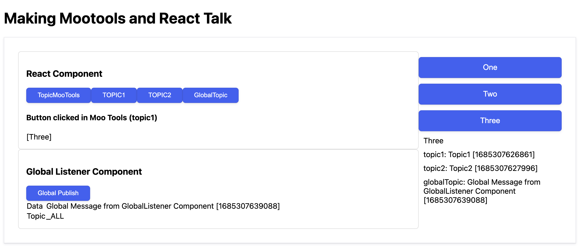

# UI Developer Assessment

In this assessment, you will demonstrate your ability to integrate modern technologies, like React, with an old codebase that uses MooTools. 

Deep knowledge of MooTools is not necessary to complete this assignment, but knowledge of similar libraries from the same era (like JQuery) will help.

## Instructions
- To view the demo, click here [](https://i.imgur.com/aSkRrN5.mp4)
- React code is contained in `new` directory
- Project Setup
  ```bash
  cd new
  npm install
  npm run test
  npm run build
  cd ..
  ```
- Open `/assessment-ui-developer/index.html` in browser

## Page communication pubsub explanation
There are 4 topics:
- **TopicMootools** (For mootools buttons commuication)
- **Topic1** and **Topic2**, to show that there can be different steams of topic
- **GlobalTopic**, to listen on all topics
  - There is a global listener in "Global Listener Component"
  - There is a global listener in Mootools UI

Here is how they fuction
- If you click on any mootools button (**[One]**, **[Two]**, **[Three]**), then it will be updated in Mootools UI, React Component, and Global Listener
- If you click on React Component -> **[TopicMooTools]**, then it will update the content in self, in mootools, and Global listener.
- If you click on **[Topic1]** or **[Topic2]**, then only `topic1` and `topic2` subscribers will be updated in Mootools UI, and Global Listener will be updated.
- If you click on **[GlobalTopic]**, then only Global Listener Component, and `globalTopic` in mootools will be updated.


--------

## Assignment

The index.html page has code that renders a very simple MooTools-based web component with 3 buttons and a div. When the buttons are clicked, they update a div's text.

The main goal is to build a modern UI component and render it in the `id="new"` div., it should do the following:

1. Update when any of the buttons on the old component are clicked
2. Have a button of it's own that when clicked updates something in the old component (bi-directional communication), using object oriented programming
3. Add a second React component to the page, it's functionality is up to you

### Requirements

1. Complete the main goal using React and TypeScript
2. Provide a git repository with your solution using a link to a publicly accessible repository
3. Changes to index.html should be minimal: it is a proxy for one of the many pages in our platform
4. Changes to the existing JavaScript are allowed but should be minimal to accomplish the assignment. `WebComponent.js` should not be changed
5. Use the git commit history to show progress and your thought process

#### Extra credit

If time allows, add unit testing to the new React code.

## Delivery

1. Create a new repository with the initial code and build your solution on top of it
2. Add a README-IMPLEMENTED.md with any details necessary
3. Once the solution is built, send your solution to your hiring contact
4. Please deliver the solution within 14 days of receiving this assessment
